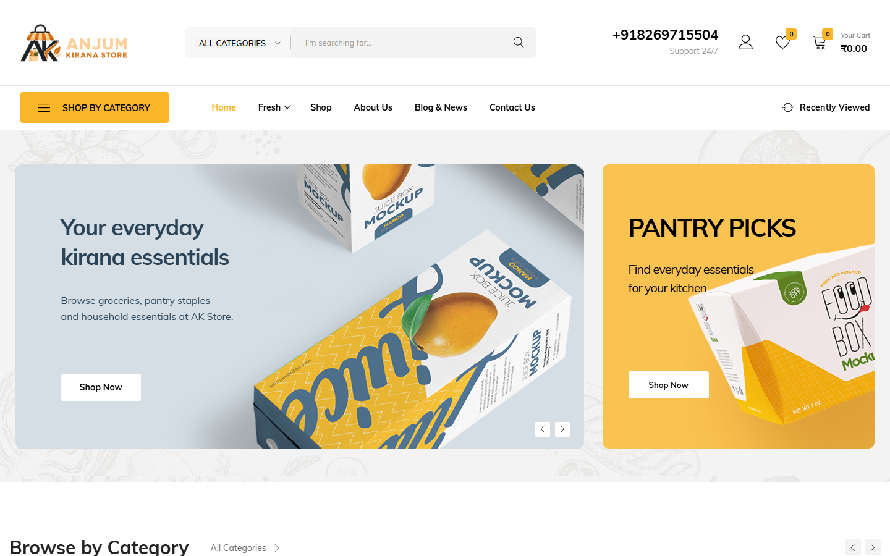
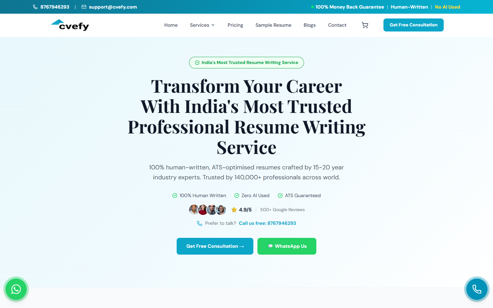
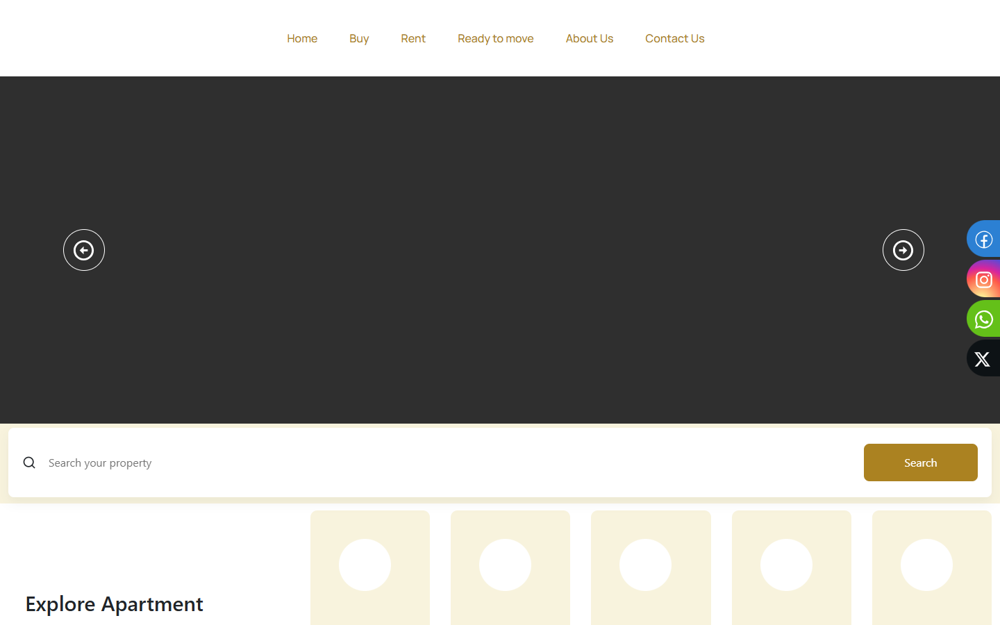
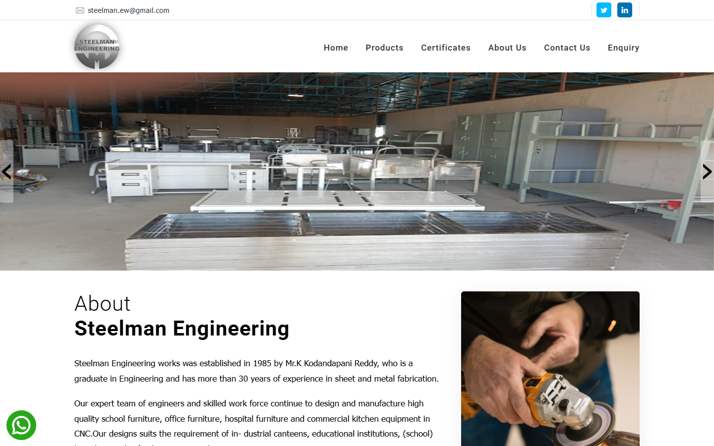
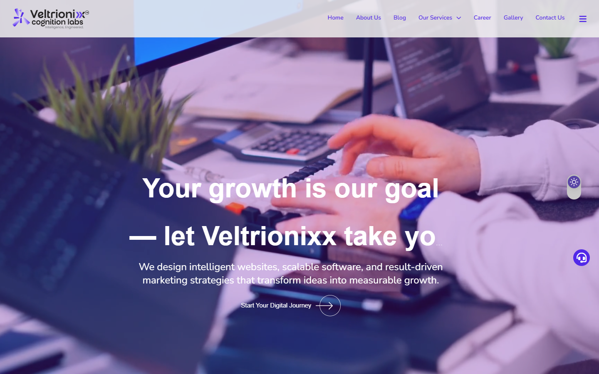
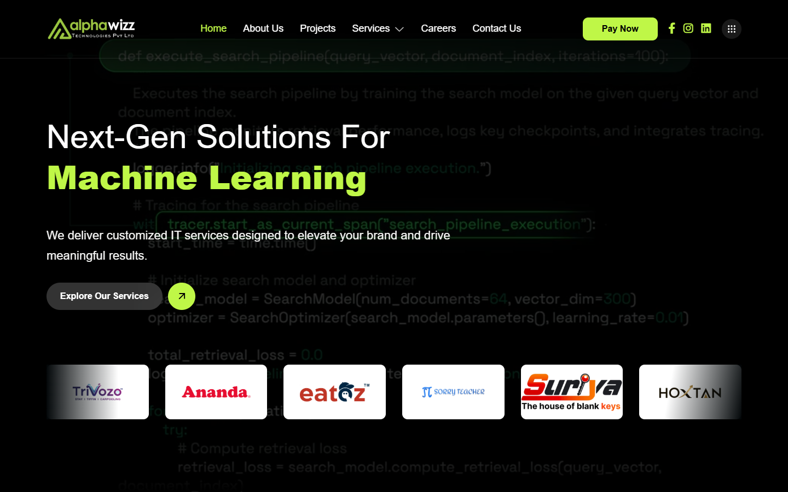
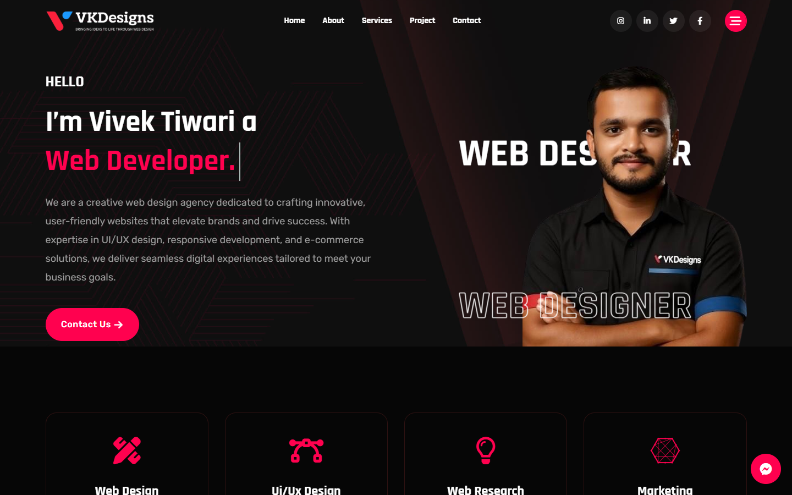

# Hi, I'm Vivek Kumar Tiwari 👋

## Experienced Full-Stack Developer & UI/UX Designer

I am an Indore-based freelance developer with **5+ years of hands-on experience** creating responsive websites, eCommerce experiences, business platforms and conversion-focused interfaces. I work across discovery, UI/UX, development, CMS implementation, integrations, optimization and launch.

[Portfolio](https://vk-designs.in/) · [LinkedIn](https://www.linkedin.com/in/vivek-k-t) · [View My Work](#selected-production-work)

## Professional Focus

| Area | Capabilities |
|---|---|
| Frontend | HTML5, CSS3, JavaScript, jQuery, Bootstrap, responsive UI |
| Platforms | WordPress, WooCommerce, Shopify, CMS customization, admin workflows |
| Product Delivery | eCommerce, catalogues, booking flows, dashboards, forms, API-led integrations |
| UI/UX | Figma, Adobe XD, wireframes, prototypes, design systems, usability |
| Visual Tools | Photoshop, Canva, responsive asset production |

## Experience

- **Freelance Full-Stack Developer & UI/UX Designer** — delivering business websites and digital products directly for clients
- **Senior Web Designer, Alphawizz Technologies Pvt. Ltd.** — 2022–2024
- **BCA (Honours), Computer Applications** — AKS University, Satna

## Featured Case Studies

| Project | Focus |
|---|---|
| [AK Store](https://akstore.co.in/) | Grocery eCommerce catalogue, search, cart and account journeys |
| [Plumbing Bazzar eCommerce](https://github.com/vivekkumartiwari79/plumbingbazzar-ecommerce) | Large sanitaryware catalogue, cart, enquiries and estimate workflows |
| [GrocyPay Platform](https://github.com/vivekkumartiwari79/grocypay-platform) | Discovery, booking, membership and rewards-oriented experience |
| [B'Premium Catalogue](https://github.com/vivekkumartiwari79/bpremium-catalog) | Premium fabric catalogue, PDF access and enquiry conversion |
| [CVefy Resume Platform](https://github.com/vivekkumartiwari79/cvefy-resume-builder) | Career-services and professional resume platform |
| [Hurrywell eCommerce](https://github.com/vivekkumartiwari79/hurrywell-ecommerce) | Ayurvedic product discovery and online shopping |
| [Manorog & Dhwani](https://github.com/vivekkumartiwari79/manorog-dhwani) | Healthcare information and appointment-focused UX |

## Selected Production Work

These are live products and websites I have worked on across freelance and professional engagements.

| Project | Domain | Live Website |
|---|---|---|
| AK Store | Grocery eCommerce | [Visit](https://akstore.co.in/) |
| Plumbing Bazzar | Sanitaryware eCommerce | [Visit](https://plumbingbazzar.com/) |
| CVefy | Resume & career services | [Visit](https://cvefy.com/) |
| Hurrywell | Ayurvedic eCommerce | [Visit](https://hurrywell.in/) |
| Manorog & Dhwani | Healthcare | [Visit](https://manorogdhwani.com/) |
| GrocyPay | Booking & rewards platform | [Visit](https://grocypay.com/) |
| B'Premium | Premium fabric catalogue | [Visit](https://bpremium.in/) |
| Uddan Realty | Real-estate platform | [Visit](https://uddanrealty.com/) |
| Haven39 | Property listings | [Visit](https://haven39.com/) |
| Steelman Engineering | Manufacturing catalogue | [Visit](https://steelmanengg.com/) |
| Veltrionixx | Digital-services website | [Visit](https://veltrionixx.com/) |
| Alphawizz | Technology company website | [Visit](https://alphawizz.com/) |
| VK Designs | Personal freelance portfolio | [Visit](https://vk-designs.in/) |

<strong>View live project screenshots</strong>

 

### AK Store

### Plumbing Bazzar

### CVefy

### Hurrywell

### Manorog & Dhwani

### GrocyPay

### B'Premium

### Uddan Realty

### Haven39

### Steelman Engineering

### Veltrionixx

### Alphawizz

### VK Designs

## Services

- Full website planning, UI/UX and responsive development
- WordPress and WooCommerce implementation
- Shopify storefront design and customization
- eCommerce, catalogue and booking experiences
- Dashboard, admin workflow and API integration support
- Redesigns, performance improvements and ongoing maintenance

## Certifications & Training

- [JavaScript Basics](https://coursera.org/verify/7JCDC6SGX9CP) — University of California, Davis / Coursera (2022)
- [Introduction to Cybersecurity for Business](https://coursera.org/verify/JTHTETLDMKCY) — University of Colorado System / Coursera (2021)
- [Introduction to Google Workspace Administration](https://coursera.org/verify/3RGSZVCGN7DP) — Google Cloud / Coursera (2022)
- [AI For Everyone](https://coursera.org/verify/MCLXSR278NQF) — DeepLearning.AI / Coursera (2021)
- AWS Cloud Computing — AKS University (2021)
- AI Tools & ChatGPT Workshop — be10x (2025)
- Containers & Kubernetes — AKS University / Rostris Infotech (2021)
- Cyber Security Measures For Youth — Webinar (2021)

## GitHub Activity

## Let's Work Together

Available for freelance website, eCommerce and digital-product projects. Visit my [personal portfolio](https://vk-designs.in/) or connect with me on [LinkedIn](https://www.linkedin.com/in/vivek-k-t).

> Project names, trademarks and website content belong to their respective owners. This profile presents selected professional work and contributions.
